# Gameplay Editor — Pipeline Flow

```mermaid
flowchart TD
    START([Start]) --> PARSE[Parse Arguments<br/>video_path, platform, language,<br/>score-threshold, duration, mode, output]
    PARSE --> VALIDATE[Validate<br/>- Video exists<br/>- ffmpeg available<br/>- Audio tracks present<br/>- Read style file<br/>- Probe resolution & fps<br/>- Create output dir<br/>- Check disk space]
    VALIDATE --> WHISPER_CHECK{faster-whisper<br/>available?}
    WHISPER_CHECK -->|yes| TIER_FULL[Full tier]
    WHISPER_CHECK -->|no| TIER_MINIMAL[Minimal tier]
    TIER_FULL --> PROMPT_CHECK
    TIER_MINIMAL --> PROMPT_CHECK

    PROMPT_CHECK{mode == analyze<br/>AND missing params?}
    PROMPT_CHECK -->|yes| PROMPT[Present single prompt<br/>language, platform, threshold]
    PROMPT_CHECK -->|no| TMP
    PROMPT --> TMP

    TMP[Create temp directory - $TMP<br/>Start PIPELINE timer]

    TMP --> AA

    subgraph AA [Audio Analyzer Agent]
        direction TB
        AA_IN[/Inputs: video_path, language,<br/>tmp_dir/]
        AA_IN --> AA_S1[Stage 1 — Track Detection<br/>ffprobe streams, classify voice vs game,<br/>measure avg loudness]
        AA_S1 --> AA_S2_CHECK{faster-whisper<br/>available?}

        AA_S2_CHECK -->|yes| AA_S2[Stage 2 — Transcription<br/>Extract voice track to WAV<br/>WhisperModel small, vad_filter=True<br/>Output: voice.srt]
        AA_S2_CHECK -->|no| AA_S2_SKIP[Skip transcription<br/>has_transcript = false]

        AA_S2 --> AA_S3
        AA_S2_SKIP --> AA_S3

        AA_S3[Stage 3 — Energy Scoring<br/>All on source video voice track]
        AA_S3 --> AA_LOUD[Loudness Analysis<br/>ebur128 per 5s window<br/>session mean & stddev]
        AA_S3 --> AA_HF[High-Freq Energy<br/>2-4kHz band per 5s window]
        AA_S3 --> AA_SIL[Silence Detection<br/>silencedetect -35dB d=3]

        AA_LOUD --> AA_NOISE[Noise Floor Measurement<br/>from longest silence ≥3s]
        AA_SIL --> AA_NOISE
        AA_SIL --> AA_TENSION[Tension-Release Detection<br/>silence ≥3s then loudness delta]
        AA_HF --> AA_CROSS[Crosstalk Detection<br/>multi-track or Whisper gap heuristic]

        AA_NOISE --> AA_SCORE[Composite Scoring — Minimal Tier<br/>0.25 Vol + 0.35 HF + 0.20 DynRange + 0.20 Breadth]
        AA_TENSION --> AA_SCORE
        AA_CROSS --> AA_SCORE
        AA_LOUD --> AA_SCORE

        AA_SCORE --> AA_MERGE[Normalize 0-100<br/>Merge adjacent windows within 10s<br/>Add 2s lead-in, 1s lead-out]
        AA_MERGE --> AA_OUT[/Output: moments, window_dimensions,<br/>noise_floor_db, has_transcript,<br/>transcript_srt, timing/]
    end

    AA --> TA_GATE

    TA_GATE{has_transcript?<br/>AND style has<br/>transcript_signals?}

    TA_GATE -->|no — skip| SELECTION
    TA_GATE -->|yes| TA

    subgraph TA [Transcript Analyzer Agent]
        direction TB
        TA_IN[/Inputs: transcript_srt, moments,<br/>transcript_signals, language,<br/>source_duration, window_size/]
        TA_IN --> TA_S1[Step 1 — Parse SRT<br/>Map segments to 5s windows]
        TA_S1 --> TA_S2[Step 2 — Window Scoring<br/>Score 0-10 per window<br/>based on transcript_signals<br/>Normalize to 0-1]
        TA_S2 --> TA_S3[Step 3 — Moment Discovery<br/>High-score windows outside<br/>existing moments]
        TA_S3 --> TA_S4[Step 4 — Clip Summaries<br/>1-2 sentences per moment<br/>in transcript language]
        TA_S4 --> TA_S5[Step 5 — Cut Boundary Refinement<br/>Align to sentence edges ±3s max]
        TA_S5 --> TA_OUT[/Output: transcript_scores,<br/>discovered_moments,<br/>moment_refinements/]
    end

    TA --> RECOMPUTE[Recompute Composite Scores — Full Tier<br/>0.20 Vol + 0.25 HF + 0.15 DynRange<br/>+ 0.15 Breadth + 0.25 Transcript<br/><br/>Merge discovered moments<br/>Apply refined timestamps & summaries<br/>Re-rank by composite score]

    RECOMPUTE --> SELECTION

    SELECTION{mode?}
    SELECTION -->|analyze| PRESENT[Present Plan<br/>All moments with scores,<br/>descriptions, summaries<br/>* = above threshold]
    PRESENT --> USER_RESPONSE[Wait for user<br/>approve / adjust threshold /<br/>include-exclude / change platform]
    USER_RESPONSE --> ASSEMBLY

    SELECTION -->|auto + duration| AUTO_DUR[Select top moments<br/>fitting target duration]
    SELECTION -->|auto| AUTO_THR[Select moments ≥ threshold]
    AUTO_DUR --> ASSEMBLY
    AUTO_THR --> ASSEMBLY

    ASSEMBLY --> EA

    subgraph EA [Edit Assembler Agent]
        direction TB
        EA_IN[/Inputs: source_video_path, moments,<br/>style, platform, output_path,<br/>noise_floor_db, resolution, fps/]

        EA_IN --> EA_SETUP[Setup<br/>Create temp dir, check disk space,<br/>determine LUFS]
        EA_SETUP --> EA_SEG_LOOP

        subgraph EA_SEG_LOOP [Step 1 — Process Each Segment]
            direction TB
            EA_EXTRACT[Single-input ffmpeg<br/>from source video]
            EA_EXTRACT --> EA_AF[Audio filters<br/>HPF 80Hz → afade in → loudnorm → agate → acompressor → afade out]
            EA_AF --> EA_VF[Apply video filters<br/>platform crop, transitions, fade]
            EA_VF --> EA_SEG_OUT[segment_N.mp4]
        end

        EA_SEG_LOOP --> EA_TK_CHECK{platform?}

        EA_TK_CHECK -->|tiktok| EA_TK[Step 2 — TikTok Post-Processing<br/>Peak 5-10s trim<br/>Clip duration rules 15s-60s]
        EA_TK_CHECK -->|youtube| EA_EXPORT

        EA_TK --> EA_EXPORT

        subgraph EA_EXPORT [Step 3 — Export]
            direction TB
            EA_PLATFORM{platform?}
            EA_PLATFORM -->|youtube| EA_CONCAT[Concat all segments<br/>ffmpeg -f concat -c copy<br/>single output file]
            EA_PLATFORM -->|tiktok| EA_CLIPS[Copy each segment as clip<br/>basename_sSCORE_tk_NN.mp4]
        end

        EA_EXPORT --> EA_CLEANUP[Step 4 — Cleanup<br/>rm -rf $TMP if success]
        EA_CLEANUP --> EA_OUT[/Output: output_files,<br/>segments_included,<br/>segments_skipped, timing/]
    end

    EA --> SUMMARY

    SUMMARY[Pipeline Summary<br/>Source & output info<br/>Moments included / excluded<br/><br/>Timing: Audio analysis<br/>Transcript analysis - User review<br/>Segment processing - Export - Total<br/><br/>Platform - Tier - Language]

    SUMMARY --> DONE([Done])

    style AA fill:#2d3a5a,stroke:#49a,color:#fff
    style TA fill:#4a2d5a,stroke:#94a,color:#fff
    style EA fill:#5a3a2d,stroke:#a94,color:#fff
    style EA_SEG_LOOP fill:#6b4a35,stroke:#a94,color:#fff
    style EA_EXPORT fill:#6b4a35,stroke:#a94,color:#fff
```

## Legend

| Color | Component | File |
|-------|-----------|------|
| Blue | Audio Analyzer Agent | `agents/audio-analyzer.md` |
| Purple | Transcript Analyzer Agent | `agents/transcript-analyzer.md` |
| Orange | Edit Assembler Agent | `agents/edit-assembler.md` |
