# Gameplay Editor — Pipeline Flow (v4)

```mermaid
flowchart TD
    START([Start]) --> PARSE[Parse Arguments<br/>video_path, language, mode, output]
    PARSE --> VALIDATE[Validate<br/>- Video exists<br/>- ffmpeg available<br/>- Audio tracks present<br/>- Read style config<br/>- Create output dir<br/>- Check disk space]
    VALIDATE --> WHISPER_CHECK{faster-whisper<br/>available?}
    WHISPER_CHECK -->|yes| TIER_FULL[Full tier]
    WHISPER_CHECK -->|no| TIER_MINIMAL[Minimal tier]
    TIER_FULL --> SESSION
    TIER_MINIMAL --> SESSION

    SESSION[Generate session_id<br/>Create temp directory<br/>Start PIPELINE timer]

    SESSION --> P1

    subgraph P1 [Phase 1: PREPARE — audio-preparer agent]
        direction TB
        P1_IN[/Inputs: video_path, tmp_dir, session_id/]
        P1_IN --> P1_S1[Track Detection<br/>ffprobe streams, classify voice vs game]
        P1_S1 --> P1_S2[Noise Profiling<br/>silencedetect, astats RMS,<br/>calibrate afftdn nr]
        P1_S2 --> P1_S3[Denoising<br/>afftdn nt=w on each voice track<br/>analysis copies only]
        P1_S3 --> P1_S4[Voice Normalization<br/>ebur128 measurement,<br/>loudnorm to -16 LUFS]
        P1_S4 --> P1_S5[Analysis Mix<br/>normalized voices + game audio at -6dB]
        P1_S5 --> P1_OUT[/Output: analysis_mix, clean_voice_tracks,<br/>noise_profiles, lufs_offsets, track_map/]
    end

    P1 --> P2

    subgraph P2 [Phase 2: DETECT — moment-detector agent]
        direction TB
        P2_IN[/Inputs: analysis_mix, clean_voice_tracks,<br/>transcript_signals, detection_threshold/]
        P2_IN --> P2_S1[Energy Scoring<br/>ebur128, highfreq 2-4kHz, dyn_range<br/>per 5s window, normalize 0-1]
        P2_S1 --> P2_WHISPER{has_whisper?}
        P2_WHISPER -->|yes| P2_S2[Transcription<br/>faster-whisper small per voice track<br/>speaker-labeled merged SRT]
        P2_WHISPER -->|no| P2_S4_MIN[Minimal Tier Scoring<br/>0.25 Vol + 0.35 HF + 0.20 DR + 0.20 Breadth]
        P2_S2 --> P2_S3[Transcript Scoring — LLM<br/>2-min chunks, 15s overlap<br/>score 0-10 per window per transcript_signals]
        P2_S3 --> P2_S4[Full Tier Scoring<br/>0.15 Vol + 0.20 HF + 0.10 DR<br/>+ 0.15 Breadth + 0.40 Transcript]
        P2_S4 --> P2_MERGE
        P2_S4_MIN --> P2_MERGE
        P2_MERGE[Over-Detection<br/>threshold=30, merge adjacent,<br/>2s lead-in, 1s lead-out,<br/>10s context zones,<br/>strong/maybe confidence tiers]
        P2_MERGE --> P2_OUT[/Output: moments with scores,<br/>descriptions, context zones,<br/>transcript data/]
    end

    P2 --> MODE_CHECK{mode?}

    MODE_CHECK -->|analyze| P3
    MODE_CHECK -->|auto| AUTO_SELECT[Auto-select strong clips<br/>score > 70]
    AUTO_SELECT --> P4

    subgraph P3 [Phase 3: CURATE — dashboard-builder agent]
        direction TB
        P3_IN[/Inputs: moments, clean_voice_tracks,<br/>session_id, source_video/]
        P3_IN --> P3_S1[Extract Audio Previews<br/>core MP3 + extended MP3 per moment]
        P3_S1 --> P3_S2[Generate Dashboard HTML<br/>clip cards, audio players,<br/>keep/remove, boundary adjust, comments]
        P3_S2 --> P3_S3[Open in Browser<br/>start dashboard.html]
        P3_S3 --> P3_S4[Poll for decisions.json<br/>5s interval, 30min timeout,<br/>session_id validation]
        P3_S4 --> P3_OUT[/Output: decisions<br/>kept/removed/commented moments/]
    end

    P3 --> P4

    subgraph P4 [Phase 4: EXPORT — export-assembler agent]
        direction TB
        P4_IN[/Inputs: decisions, moments,<br/>noise_profiles, track_map,<br/>style, output_dir/]
        P4_IN --> P4_S1[Process Feedback<br/>interpret comments, apply boundary changes,<br/>tag shorts, sort chronologically]
        P4_S1 --> P4_S2[Audio Mastering — from raw tracks<br/>HPF → afftdn → agate → acompressor → loudnorm<br/>per-speaker normalization]
        P4_S2 --> P4_S3[Highlight Reel<br/>extract segments, transitions,<br/>concat to single MP4]
        P4_S3 --> P4_S4[Shorts Generation<br/>top N by score + user-tagged,<br/>9:16 crop, -12 LUFS, 15-60s]
        P4_S4 --> P4_OUT[/Output: highlight.mp4,<br/>short_01.mp4, short_02.mp4, .../]
    end

    P4 --> SUMMARY[Pipeline Summary<br/>files, sizes, durations, timing]
    SUMMARY --> QUICKFIX{User wants<br/>corrections?}
    QUICKFIX -->|yes| P4
    QUICKFIX -->|no| CLEANUP[Cleanup temp files]
    CLEANUP --> DONE([Done])

    style P1 fill:#2d3a5a,stroke:#49a,color:#fff
    style P2 fill:#4a2d5a,stroke:#94a,color:#fff
    style P3 fill:#2d5a3a,stroke:#4a9,color:#fff
    style P4 fill:#5a3a2d,stroke:#a94,color:#fff
```

## Legend

| Color | Phase | Agent |
|-------|-------|-------|
| Blue | Phase 1: Prepare | `agents/audio-preparer.md` |
| Purple | Phase 2: Detect | `agents/moment-detector.md` |
| Green | Phase 3: Curate | `agents/dashboard-builder.md` |
| Orange | Phase 4: Export | `agents/export-assembler.md` |
