# V4 Clip Dashboard Pipeline — Implementation Plan

> **For agentic workers:** REQUIRED SUB-SKILL: Use superpowers:subagent-driven-development (recommended) or superpowers:executing-plans to implement this plan task-by-task. Steps use checkbox (`- [ ]`) syntax for tracking.

**Goal:** Rewrite the gameplay-editor plugin from v3 (3-agent threshold pipeline) to v4 (4-phase dashboard pipeline with deferred export and auto-generated shorts).

**Architecture:** Four markdown agent definitions aligned to four pipeline phases (Prepare, Detect, Curate, Export), orchestrated by a rewritten `gameplay-edit` command. Phase 3 introduces an HTML clip dashboard with audio previews for curation. All rendering deferred to Phase 4.

**Tech Stack:** Markdown agent definitions (Claude Code plugin), ffmpeg/ffprobe, Python 3 + faster-whisper (optional), HTML/CSS/JS for dashboard.

**Spec:** `docs/superpowers/specs/2026-03-24-v4-clip-dashboard-pipeline-design.md`

---

## File Map

### New Files
| File | Responsibility |
|------|---------------|
| `agents/audio-preparer.md` | Phase 1: track detection, noise profiling, denoising, voice normalization |
| `agents/moment-detector.md` | Phase 2: energy scoring, transcription, transcript scoring, over-detection |
| `agents/dashboard-builder.md` | Phase 3: extract audio previews, generate HTML dashboard, poll for decisions |
| `agents/export-assembler.md` | Phase 4: process feedback, master audio, assemble highlight reel + shorts |

### Modified Files
| File | Changes |
|------|---------|
| `commands/gameplay-edit.md` | Complete rewrite: 4-phase orchestration, new args, session_id, polling |
| `styles/clean.md` | Add `shorts_count`, `shorts_duration_range`, `detection_threshold` |
| `skills/gameplay-editor/SKILL.md` | Update description for v4 workflow |
| `docs/scoring-weights.md` | Update to v4 weights (Transcript 0.40) |
| `docs/pipeline-flow.md` | Rewrite mermaid diagram for 4-phase flow |
| `.claude-plugin/plugin.json` | Version bump to 4.0.0 |
| `.claude-plugin/marketplace.json` | Version bump to 4.0.0, update description |

### Deleted Files
| File | Reason |
|------|--------|
| `agents/audio-analyzer.md` | Split into audio-preparer + moment-detector |
| `agents/transcript-analyzer.md` | Merged into moment-detector |
| `agents/edit-assembler.md` | Replaced by new export-assembler |

---

## Task 1: Update Style Config

**Files:**
- Modify: `styles/clean.md`

- [ ] **Step 1: Add v4 fields to clean.md frontmatter**

Add three new fields to the YAML frontmatter, after the existing `transcript_signals` block:

```yaml
---
name: clean
transitions: fade
transition_duration: 0.3
audio_normalization: standard
aspect_ratio: per-platform
export_codec: libx264
export_quality: 20
transcript_signals:
  - humor
  - dramatic reactions
  - surprised exclamations
  - banter
  - storytelling peaks
  - emotional outbursts
  - comedic timing
shorts_count: 3
shorts_duration_range: [15, 60]
detection_threshold: 30
---

# Clean Style

Minimal editing. Content speaks for itself.

Hard cuts with subtle fade transitions (0.3s). No overlays or effects.

Audio pipeline is always-on: noise reduction, per-track normalization,
dynamic compression, and game audio leveling are applied automatically.

Aspect ratio and audio LUFS are determined by the target platform (youtube or tiktok).
```

- [ ] **Step 2: Commit**

```bash
git add styles/clean.md
git commit -m "feat: add v4 style fields (shorts_count, shorts_duration_range, detection_threshold)"
```

---

## Task 2: Write audio-preparer Agent (Phase 1)

**Files:**
- Create: `agents/audio-preparer.md`

This agent handles Phase 1: PREPARE. It takes a raw video and produces clean, normalized audio for analysis.

- [ ] **Step 1: Write the agent definition**

Create `agents/audio-preparer.md` with the following content. This is the complete file:

````markdown
---
name: audio-preparer
description: |
  Use this agent to prepare audio tracks from a gameplay video for analysis.
  Detects tracks, profiles noise, denoises voice, normalizes speaker levels.
  Returns clean audio files and metadata for downstream analysis.
model: sonnet
---

# Audio Preparer Agent

You prepare raw gameplay video audio for downstream analysis. Your job is to produce clean, normalized voice tracks and an analysis mix — not to detect moments or score anything.

## Input

You receive:
- **video_path**: path to the source video file
- **tmp_dir**: temp directory for intermediate files
- **session_id**: unique session identifier (for dashboard stale detection)

## Windows Compatibility

All Python invocations (`python3` or `python`) MUST be prefixed with `PYTHONUTF8=1` to force UTF-8 encoding on stdout/stderr. Avoid printing non-ASCII decorative characters (e.g., `★`, `→`, `─`) from Python scripts. Use ASCII equivalents (`*`, `->`, `-`).

## Step 1: Track Detection & Classification

Run:
```bash
ffprobe -v quiet -print_format json -show_streams "<video_path>"
```

Parse the JSON output. For each stream where `codec_type == "audio"`:
- Note the stream index, channel count (`channels`), sample rate (`sample_rate`)
- Measure average loudness:
  ```bash
  ffmpeg -i "<video_path>" -map 0:a:<index> -af "ebur128=peak=true" -f null - 2>&1 | grep "I:"
  ```

**Auto-classify tracks:**
- Mono (1 channel) + lower integrated loudness = **voice** track
- Stereo (2 channels) + higher sustained loudness = **game** track
- Multiple mono tracks = multiple **voice** tracks (friends on separate channels)
- Single track only = **combined** (treat as voice, no separation)

If classification is ambiguous (e.g., all stereo with similar loudness), ask the user to label tracks.

Report: `"Found N audio tracks: [track labels with indices]"`

## Step 2: Noise Profiling

For each voice track, find the longest silence segment:

```bash
ffmpeg -i "<video_path>" -map 0:a:<voice_index> -af "silencedetect=noise=-35dB:d=3" -f null - 2>&1
```

Parse `silence_start` and `silence_end` timestamps. Find the longest segment >=3s.

Measure noise floor RMS from that silence:
```bash
ffmpeg -i "<video_path>" -ss <silence_start> -t <silence_duration> \
  -map 0:a:<voice_index> -af "astats=metadata=1:reset=1,ametadata=print:key=lavfi.astats.Overall.RMS_level:file=<tmp_dir>/noise_floor_track<N>.txt" -f null - 2>&1
```

Parse the average RMS level from the output file. This is the track's `noise_floor_rms`.

**Calibrate denoising strength:**
```
afftdn_nr = clamp(abs(noise_floor_rms) - 20, 10, 40)
```
- Noisier recordings (lower RMS, e.g., -60dB) get stronger reduction (nr=40)
- Clean recordings (higher RMS, e.g., -30dB) get light touch (nr=10)

**Fallback:** If no silence segment >=3s is found for a track, use the first 30 seconds:
```bash
ffmpeg -i "<video_path>" -ss 0 -t 30 \
  -map 0:a:<voice_index> -af "astats=metadata=1:reset=1,ametadata=print:key=lavfi.astats.Overall.RMS_level:file=<tmp_dir>/noise_floor_track<N>.txt" -f null - 2>&1
```
Take the minimum RMS value from the output. Warn: `"No silence >=3s found on track N, using first 30s for noise profile (less accurate)"`

Report per track: noise_floor_rms and calibrated afftdn_nr value.

## Step 3: Denoising

For each voice track, apply denoising to produce a clean analysis copy:

```bash
ffmpeg -i "<video_path>" -map 0:a:<voice_index> \
  -af "afftdn=nr=<afftdn_nr>:nt=w" \
  -ac 1 -ar 16000 -y "<tmp_dir>/voice_clean_<N>.wav"
```

- `nt=w` = Wiener method for best quality
- `-ac 1 -ar 16000` = mono 16kHz (ready for Whisper transcription and analysis)
- These are **analysis copies only**. The original raw tracks are preserved for Phase 4 export.

Verify each output file exists and has non-zero size.

## Step 4: Speaker Detection & Voice Normalization

Measure each clean voice track's integrated loudness:

```bash
ffmpeg -i "<tmp_dir>/voice_clean_<N>.wav" -af "ebur128=peak=true" -f null - 2>&1 | grep "I:"
```

Parse the integrated loudness (I:) value in LUFS. Compute the offset from -16 LUFS target:
```
lufs_offset_N = -16 - measured_lufs_N
```

Normalize each voice track for analysis:
```bash
ffmpeg -i "<tmp_dir>/voice_clean_<N>.wav" \
  -af "loudnorm=I=-16:LRA=11:TP=-1.5" \
  -y "<tmp_dir>/voice_norm_<N>.wav"
```

For a single combined track, normalize the whole track. Skip per-speaker normalization.

## Step 5: Prepare Analysis Mix

Mix all normalized voice tracks + game audio (attenuated -6dB) into a single analysis mix.

**If multiple voice tracks + game audio:**
```bash
ffmpeg -i "<tmp_dir>/voice_norm_0.wav" -i "<tmp_dir>/voice_norm_1.wav" \
  -i "<video_path>" -map 0:a -map 1:a -map 2:a:<game_index> \
  -filter_complex "[0:a][1:a]amix=inputs=2:duration=longest[voices];[2:a]volume=-6dB[game];[voices][game]amix=inputs=2:duration=longest[out]" \
  -map "[out]" -ac 1 -ar 16000 -y "<tmp_dir>/analysis_mix.wav"
```

**If single voice track + game audio:**
```bash
ffmpeg -i "<tmp_dir>/voice_norm_0.wav" \
  -i "<video_path>" -map 0:a -map 1:a:<game_index> \
  -filter_complex "[1:a]volume=-6dB[game];[0:a][game]amix=inputs=2:duration=longest[out]" \
  -map "[out]" -ac 1 -ar 16000 -y "<tmp_dir>/analysis_mix.wav"
```

**If single combined track (no separate game audio):**
The normalized voice track IS the analysis mix:
```bash
cp "<tmp_dir>/voice_norm_0.wav" "<tmp_dir>/analysis_mix.wav"
```

## Output

Return a structured result as a fenced JSON code block:

```json
{
  "session_id": "<session_id>",
  "source_duration": 12255.0,
  "source_width": 1920,
  "source_height": 1080,
  "source_fps": 60.0,
  "track_map": {
    "voice": [
      { "stream_index": 0, "label": "Speaker 1", "channels": 1 },
      { "stream_index": 1, "label": "Speaker 2", "channels": 1 }
    ],
    "game": { "stream_index": 2, "channels": 2 }
  },
  "noise_profiles": [
    { "track_index": 0, "noise_floor_rms": -52.3, "afftdn_nr": 32, "silence_method": "longest_silence" },
    { "track_index": 1, "noise_floor_rms": -48.1, "afftdn_nr": 28, "silence_method": "longest_silence" }
  ],
  "lufs_offsets": [
    { "track_index": 0, "measured_lufs": -22.4, "offset": 6.4 },
    { "track_index": 1, "measured_lufs": -19.1, "offset": 3.1 }
  ],
  "files": {
    "analysis_mix": "<tmp_dir>/analysis_mix.wav",
    "clean_voice_tracks": ["<tmp_dir>/voice_clean_0.wav", "<tmp_dir>/voice_clean_1.wav"],
    "normalized_voice_tracks": ["<tmp_dir>/voice_norm_0.wav", "<tmp_dir>/voice_norm_1.wav"]
  },
  "timing": {
    "track_detection_ms": 4200,
    "noise_profiling_ms": 1200,
    "denoising_ms": 45000,
    "normalization_ms": 8000,
    "mixing_ms": 3000,
    "total_ms": 61400
  }
}
```

**Fields:**
- `track_map`: Which tracks are voice vs. game, with stream indices for Phase 4
- `noise_profiles`: Per-track RMS and calibrated `afftdn_nr` — reused by Phase 4 export
- `lufs_offsets`: Per-track LUFS measurement and offset from -16 target
- `files.clean_voice_tracks`: Denoised mono 16kHz WAVs for transcription
- `files.normalized_voice_tracks`: Denoised + normalized WAVs (analysis only)
- `files.analysis_mix`: Combined mix for energy scoring
- `silence_method`: `"longest_silence"` or `"first_30s_fallback"`
````

- [ ] **Step 2: Commit**

```bash
git add agents/audio-preparer.md
git commit -m "feat: add audio-preparer agent (Phase 1 — track detection, denoise, normalize)"
```

---

## Task 3: Write moment-detector Agent (Phase 2)

**Files:**
- Create: `agents/moment-detector.md`

This agent handles Phase 2: DETECT. It replaces both the old audio-analyzer's scoring logic and the transcript-analyzer, unifying them into a single agent that over-detects moments.

- [ ] **Step 1: Write the agent definition**

Create `agents/moment-detector.md` with the following content:

````markdown
---
name: moment-detector
description: |
  Use this agent to detect and score moments in pre-processed gameplay audio.
  Performs energy scoring, transcription, LLM transcript scoring, and over-detection.
  Returns a comprehensive moment list with extended context for dashboard curation.
model: sonnet
---

# Moment Detector Agent

You detect exciting moments in gameplay audio that has already been cleaned and normalized by the audio-preparer. You score using both audio energy and transcript analysis, intentionally over-detecting to let the user curate in the dashboard.

## Input

You receive:
- **analysis_mix**: path to the combined analysis WAV (from audio-preparer)
- **clean_voice_tracks**: list of paths to individual denoised voice WAVs (for transcription)
- **track_map**: which tracks are voice vs. game (from audio-preparer)
- **source_duration**: total video length in seconds
- **language**: Whisper language code (default: `hu`)
- **tmp_dir**: temp directory for intermediate files
- **transcript_signals**: list from the active style (e.g., `["humor", "dramatic reactions", "banter"]`)
- **detection_threshold**: minimum score to include (default: 30 — intentionally low for over-detection)
- **has_whisper**: boolean — whether faster-whisper is available

## Windows Compatibility

All Python invocations (`python3` or `python`) MUST be prefixed with `PYTHONUTF8=1`. Avoid non-ASCII decorative characters in Python output.

## Step 1: Energy Scoring

On the analysis mix, compute per-5-second-window dimensions:

### Loudness (Volume)

```bash
ffmpeg -i "<analysis_mix>" -af "ebur128=metadata=1,ametadata=print:key=lavfi.r128.M:file=<tmp_dir>/loudness.txt" -f null - 2>&1
```

Parse momentary loudness (M) values. Group into 5-second windows. Compute session mean and stddev.

### High-Frequency Energy

```bash
ffmpeg -i "<analysis_mix>" -af "highpass=f=2000,lowpass=f=4000,ebur128=metadata=1,ametadata=print:key=lavfi.r128.M:file=<tmp_dir>/highfreq.txt" -f null - 2>&1
```

Extract per-5-second-window energy in the 2-4kHz band.

### Dynamic Range

From the loudness data, compute per-second amplitude standard deviation within each 5-second window.

### Normalization

Normalize each dimension to 0-1 range: `normalized = value / max(all_values_for_dimension)`. This is max-normalization (not min-max), so the highest window = 1.0 and silence = 0.0. Consistent across all dimensions including transcript scoring.

## Step 2: Transcription (Full Tier only)

**Gate:** Only run if `has_whisper` is true.

For each clean voice track, run faster-whisper:

```bash
PYTHONUTF8=1 python3 << 'PYEOF'
import sys
from faster_whisper import WhisperModel

model = WhisperModel("small", device="auto", compute_type="auto")
wav_path = "<clean_voice_track_N>"
segments, info = model.transcribe(wav_path, language="<language>", vad_filter=True)

count = 0
with open("<tmp_dir>/voice_<N>.srt", "w", encoding="utf-8") as f:
    for i, seg in enumerate(segments, 1):
        count = i
        def fmt(t):
            h = int(t // 3600)
            m = int((t % 3600) // 60)
            s = int(t % 60)
            ms = int((t % 1) * 1000)
            return f"{h:02d}:{m:02d}:{s:02d},{ms:03d}"
        f.write(f"{i}\n{fmt(seg.start)} --> {fmt(seg.end)}\n{seg.text.strip()}\n\n")

print(f"Transcribed {count} segments, language: {info.language} (prob={info.language_probability:.2f})")
PYEOF
```

**Merge transcripts with speaker labels:**
- Read each `.srt` file
- Prefix each segment's text with the speaker label from `track_map` (e.g., "Speaker 1: ", "Speaker 2: ")
- Merge all segments chronologically into `<tmp_dir>/merged_transcript.srt`
- Resolve overlapping segments by interleaving

If transcription fails, warn and set `has_transcript: false`. Continue with audio-only scoring.

## Step 3: Transcript Scoring (LLM Pass, Full Tier only)

**Gate:** Only run if transcription produced a valid `.srt`.

Read the merged transcript in **2-minute chunks with 15-second overlap** at boundaries.

For each chunk, score its constituent 5-second windows 0-10 based on the `transcript_signals` criteria:

| Range | Meaning |
|-------|---------|
| 0 | Silence or completely uninteresting |
| 1-3 | Normal conversation, no signal match |
| 4-6 | Mild signal presence (slight humor, minor reaction) |
| 7-8 | Strong signal match (clear humor, dramatic moment) |
| 9-10 | Peak excitement (multiple strong signals converging) |

For overlap windows (appearing in two chunks), take the higher score.

Normalize all raw scores to 0-1: `normalized = raw_score / max(all_raw_scores)`. If all zero, stay zero.

For each moment, write a 1-2 sentence summary describing what's happening. Summaries must be in the **transcript's language** (e.g., Hungarian if gameplay is in Hungarian). Be specific — "Speaker 1 tells a story about X, Speaker 2 starts laughing" not "an exciting moment occurs."

**Failure handling:** If LLM scoring fails (timeout, malformed output), retry once. If still failing, fall back to Minimal Tier weights (audio-only) for affected chunks and warn user.

## Step 4: Moment Assembly

### Compute Composite Scores

**Full Tier (has_transcript = true):**
```
score = 0.15 x Volume + 0.20 x HighFreq + 0.10 x DynRange + 0.15 x Breadth + 0.40 x Transcript
```

**Minimal Tier (has_transcript = false):**
```
score = 0.25 x Volume + 0.35 x HighFreq + 0.20 x DynRange + 0.20 x Breadth
```

**Breadth calculation:**
- Full Tier: `active_of(Volume, HighFreq, DynRange, Transcript) / 4` — Breadth itself excluded from its own count
- Minimal Tier: `active_of(Volume, HighFreq, DynRange) / 3`
- A dimension is "active" if its normalized value > 0.08

Normalize composite scores to 0-100 (max window = 100).

### Merge and Pad

- Include everything scoring above `detection_threshold` (default 30)
- Adjacent above-threshold windows (gap <= 10s) merge into one continuous moment
- Moment score = peak window score within the merged moment
- Add 2s lead-in and 1s lead-out padding (asymmetric — captures buildup)
- No overlap with neighboring moments' core boundaries

### Extended Context Zones

For each moment, compute a context zone:
- Context start = moment start - 10s (clamped to 0 and to neighboring moment's core end)
- Context end = moment end + 10s (clamped to source_duration and to neighboring moment's core start)

### Confidence Tiers

- **Strong:** score > 70, at least 2 dimensions with normalized value > 0.08
- **Maybe:** score 30-70, or only 1 active dimension

## Output

Return a structured result as a fenced JSON code block:

```json
{
  "tier": "full",
  "has_transcript": true,
  "session_mean": 42.3,
  "session_stddev": 18.7,
  "transcript_srt": "<tmp_dir>/merged_transcript.srt",
  "moments": [
    {
      "id": 1,
      "start": 748.0,
      "end": 787.0,
      "duration": 39.0,
      "score": 95,
      "confidence": "strong",
      "dimensions": {
        "volume": 0.82,
        "high_freq": 0.91,
        "dyn_range": 0.65,
        "breadth": 1.0,
        "transcript": 0.88
      },
      "signals": ["volume_spike", "high_freq", "crosstalk"],
      "audio_description": "Mass laughter, 3 voices overlapping, volume spike +12dB above mean",
      "transcript_excerpt": "Speaker 1: DID HE JUST-- Speaker 2: NO WAY! [laughing]",
      "summary": "Mindenki egyszerre kiabál amikor a csapattárs véletlenül felrobbantja az egész bázist",
      "context_start": 738.0,
      "context_end": 797.0
    }
  ],
  "window_dimensions": [
    { "window_start": 0.0, "window_end": 5.0, "volume": 0.32, "high_freq": 0.15, "dyn_range": 0.22, "transcript": 0.05 }
  ],
  "timing": {
    "energy_scoring_ms": 8000,
    "transcription_ms": 758000,
    "transcript_scoring_ms": 45000,
    "assembly_ms": 200,
    "total_ms": 811200
  }
}
```

**Fields:**
- `moments[].id`: Sequential integer, used as stable reference through dashboard and export
- `moments[].context_start`/`context_end`: Extended zone for "hear more" in dashboard
- `moments[].dimensions`: Per-dimension normalized values (0-1) for this moment's peak window
- `moments[].confidence`: `"strong"` or `"maybe"`
- `moments[].summary`: LLM-generated description in transcript language (only in Full Tier; empty string in Minimal)
- `window_dimensions`: Every 5s window's dimensions — used if dashboard needs fine-grained data
````

- [ ] **Step 2: Commit**

```bash
git add agents/moment-detector.md
git commit -m "feat: add moment-detector agent (Phase 2 — scoring, transcription, over-detection)"
```

---

## Task 4: Write dashboard-builder Agent (Phase 3)

**Files:**
- Create: `agents/dashboard-builder.md`

This is the core UX innovation — the HTML clip dashboard with audio previews.

- [ ] **Step 1: Write the agent definition**

Create `agents/dashboard-builder.md` with the following content:

````markdown
---
name: dashboard-builder
description: |
  Use this agent to build an HTML clip dashboard for curating gameplay moments.
  Extracts audio previews, generates an interactive dashboard, and polls for user decisions.
model: sonnet
---

# Dashboard Builder Agent

You build an HTML dashboard that lets the user listen to detected moments, keep or remove clips, adjust boundaries, and leave comments — all in the browser. You then poll for the user's decisions and return them for export.

## Input

You receive:
- **moments**: the full moment list from moment-detector (with scores, descriptions, context zones)
- **clean_voice_tracks**: paths to denoised voice WAVs (from audio-preparer)
- **track_map**: voice track info (for multi-track mixing in previews)
- **session_id**: unique session identifier
- **source_video**: original video path (for reference in decisions.json)
- **tmp_dir**: temp directory
- **has_transcript**: whether transcript data is available

## Windows Compatibility

All Python invocations MUST be prefixed with `PYTHONUTF8=1`. Dashboard opened with `start` command on Windows.

## Step 1: Extract Audio Previews

For each moment, extract two audio clips from the clean voice tracks:

### Core preview (the detected moment)

If single voice track:
```bash
ffmpeg -ss <moment.start> -t <moment.duration> -i "<clean_voice_track_0>" \
  -c:a libmp3lame -b:a 128k -y "<tmp_dir>/preview_<id>.mp3"
```

If multiple voice tracks, mix them:
```bash
ffmpeg -ss <moment.start> -t <moment.duration> -i "<clean_voice_track_0>" \
  -ss <moment.start> -t <moment.duration> -i "<clean_voice_track_1>" \
  -filter_complex "[0:a][1:a]amix=inputs=2:duration=first" \
  -c:a libmp3lame -b:a 128k -y "<tmp_dir>/preview_<id>.mp3"
```

### Extended preview (context zone — for "hear more")

```bash
ffmpeg -ss <moment.context_start> -t <context_duration> -i "<clean_voice_track_0>" \
  [-i "<clean_voice_track_1>" -filter_complex "...amix..."] \
  -c:a libmp3lame -b:a 128k -y "<tmp_dir>/preview_ext_<id>.mp3"
```

Where `context_duration = moment.context_end - moment.context_start`.

Report progress: `"Extracting audio preview N/M..."`

## Step 2: Generate Dashboard HTML

Generate a single self-contained HTML file at `<tmp_dir>/dashboard.html`. The file must include all CSS and JS inline (no external dependencies). Audio files are referenced by relative path.

**The HTML must implement the following UI:**

### Header
- Source filename and total moment count
- Tier breakdown: "N strong, M maybe"
- "Approve All" button (marks all as kept, writes decisions.json immediately)

### Clip Cards (one per moment, ordered by score descending)

Each card contains:
- **Clip number** (#1, #2, ...), **confidence badge** (STRONG in green / MAYBE in amber), **score** (0-100), **timestamps** (HH:MM:SS -> HH:MM:SS), **duration**
- **Description**: the `summary` field (Full Tier) or `audio_description` (Minimal Tier)
- **Audio player**: HTML5 `<audio>` element with controls, source = `preview_<id>.mp3`
- **"Hear More" buttons**: Two buttons, "Hear Before (+10s)" and "Hear After (+10s)". Clicking swaps the audio source to `preview_ext_<id>.mp3` and seeks to the appropriate position. Clicking again restores the core preview.
- **Transcript excerpt**: if available, shown in a collapsible section with speaker labels
- **Keep/Remove toggle**: Two styled buttons. Default state:
  - Strong clips (score > 70): "Keep" selected (green highlight)
  - Maybe clips (score <= 70): "Keep" selected but card has dimmed background
- **Boundary adjustment**: Four buttons: `-5s start`, `+5s start`, `-5s end`, `+5s end`. Each click updates the displayed timestamps. The adjusted start/end values are stored in JS state. Adjusted timestamps cannot go beyond the context zone boundaries.
- **Comment field**: A text input with placeholder "Optional: instructions for the agent..."

### Visual Styling
- Dark theme (matches typical gaming/editing aesthetic)
- Cards separated by horizontal rules
- Strong clips: full opacity, slight green left-border
- Maybe clips: 70% opacity, amber left-border
- Removed clips: 30% opacity, red left-border, card collapsed
- Responsive layout — works at any width

### Footer
- Running summary: "X kept, Y removed, Z with comments"
- **"Save & Close"** button — prominent, centered

### JavaScript Behavior

**State management:**
```javascript
// Each moment tracked in an array
const decisions = moments.map(m => ({
  id: m.id,
  action: 'keep',  // or 'remove'
  start: m.start,
  end: m.end,
  original_start: m.start,
  original_end: m.end,
  comment: ''
}));
```

**Keep/Remove toggle:** Clicking toggles `action` between `'keep'` and `'remove'`. Updates card opacity and summary counts.

**Boundary buttons:** Each click adjusts `start` or `end` by 5s. Clamps to `[context_start, context_end]`. Updates displayed timestamps.

**Comment field:** `oninput` handler saves text to the decision's `comment` field.

**Save & Close button:**
```javascript
function saveAndClose() {
  const output = {
    version: 1,
    session_id: SESSION_ID,
    source_video: SOURCE_VIDEO,
    moments: decisions
  };
  fetch('http://localhost:' + SERVER_PORT + '/save', {
    method: 'POST',
    headers: {'Content-Type': 'application/json'},
    body: JSON.stringify(output, null, 2)
  }).then(() => {
    document.body.innerHTML = '<div style="display:flex;align-items:center;justify-content:center;height:100vh;background:#1a1a2e;color:#eee;font-size:24px;font-family:sans-serif"><div style="text-align:center"><h1>Saved!</h1><p>Return to your terminal to continue.</p></div></div>';
  }).catch(err => {
    alert('Failed to save. Make sure the terminal is still running. Error: ' + err.message);
  });
}
```

**Dashboard-to-agent communication:** The dashboard communicates with a lightweight Python HTTP server started by the agent (see Step 3). The server accepts POST to `/save` and writes `decisions.json` to the temp directory. This avoids the fragile "download and manually move file" pattern — saving is a single click with no user intervention.

**Approve All button:**
Sets all decisions to `action: 'keep'`, then calls `saveAndClose()`.

## Step 3: Start Local Server and Open Dashboard

Start a lightweight Python HTTP server that serves the dashboard and accepts the save POST:

```bash
PYTHONUTF8=1 python3 << 'PYEOF'
import http.server, json, os, threading, webbrowser, socketserver

tmp_dir = "<tmp_dir>"
session_id = "<session_id>"
decisions_path = os.path.join(tmp_dir, "decisions.json")
saved = threading.Event()

class Handler(http.server.SimpleHTTPRequestHandler):
    def __init__(self, *args, **kwargs):
        super().__init__(*args, directory=tmp_dir, **kwargs)

    def do_POST(self):
        if self.path == '/save':
            length = int(self.headers['Content-Length'])
            data = json.loads(self.rfile.read(length))
            if data.get('session_id') == session_id:
                with open(decisions_path, 'w', encoding='utf-8') as f:
                    json.dump(data, f, indent=2)
                self.send_response(200)
                self.end_headers()
                self.wfile.write(b'OK')
                saved.set()
            else:
                self.send_response(400)
                self.end_headers()
                self.wfile.write(b'Session mismatch')
        else:
            self.send_response(404)
            self.end_headers()

    def log_message(self, format, *args):
        pass  # Suppress request logging

with socketserver.TCPServer(("127.0.0.1", 0), Handler) as httpd:
    port = httpd.server_address[1]
    print(f"SERVER_PORT={port}")

    # Inject the port into the HTML
    html_path = os.path.join(tmp_dir, "dashboard.html")
    with open(html_path, 'r', encoding='utf-8') as f:
        html = f.read()
    html = html.replace('SERVER_PORT_PLACEHOLDER', str(port))
    with open(html_path, 'w', encoding='utf-8') as f:
        f.write(html)

    # Open browser
    webbrowser.open(f"http://localhost:{port}/dashboard.html")

    # Wait for save or timeout (30 minutes)
    thread = threading.Thread(target=httpd.serve_forever)
    thread.daemon = True
    thread.start()

    if saved.wait(timeout=1800):
        with open(decisions_path, encoding='utf-8') as f:
            data = json.load(f)
        kept = sum(1 for m in data['moments'] if m['action'] == 'keep')
        removed = sum(1 for m in data['moments'] if m['action'] == 'remove')
        commented = sum(1 for m in data['moments'] if m.get('comment', ''))
        print(f"Decisions loaded: {kept} kept, {removed} removed, {commented} with comments")
    else:
        print("TIMEOUT: Dashboard timed out after 30 minutes.")

    httpd.shutdown()
PYEOF
```

Report to the user:
```
Dashboard opened in your browser.
Listen to clips, keep or remove them, adjust boundaries, leave comments.
Click "Save & Close" when done — your decisions are saved automatically.
```

**Note:** The HTML must use `SERVER_PORT_PLACEHOLDER` as the port value in the `fetch()` URL, which gets replaced by the actual port before the browser opens. The JS variable is: `const SERVER_PORT = SERVER_PORT_PLACEHOLDER;`

If timeout: report `"Dashboard timed out after 30 minutes. Re-run /gameplay-edit to start over."`

## Output

Return the decisions as a fenced JSON code block:

```json
{
  "session_id": "<session_id>",
  "decisions": {
    "version": 1,
    "source_video": "path/to/recording.mkv",
    "moments": [
      {
        "id": 1,
        "action": "keep",
        "start": 748.0,
        "end": 787.0,
        "original_start": 748.0,
        "original_end": 787.0,
        "comment": ""
      },
      {
        "id": 2,
        "action": "remove",
        "start": 1200.0,
        "end": 1225.0,
        "original_start": 1200.0,
        "original_end": 1225.0,
        "comment": ""
      }
    ]
  },
  "summary": {
    "kept": 28,
    "removed": 9,
    "commented": 3,
    "boundary_adjusted": 5
  },
  "timing": {
    "preview_extraction_ms": 12000,
    "html_generation_ms": 500,
    "user_curation_ms": 180000,
    "total_ms": 192500
  }
}
```
````

- [ ] **Step 2: Commit**

```bash
git add agents/dashboard-builder.md
git commit -m "feat: add dashboard-builder agent (Phase 3 — HTML clip dashboard with audio previews)"
```

---

## Task 5: Write export-assembler Agent (Phase 4)

**Files:**
- Create: `agents/export-assembler.md`

This replaces the old edit-assembler with Phase 4: deferred export including highlight reel + shorts.

- [ ] **Step 1: Write the agent definition**

Create `agents/export-assembler.md` with the following content:

````markdown
---
name: export-assembler
description: |
  Use this agent to export the final highlight reel and shorts from curated moments.
  Processes dashboard feedback, masters audio from raw tracks, assembles video, generates shorts.
model: sonnet
---

# Export Assembler Agent

You produce the final video outputs from curated moments. You work from the **original raw tracks** (not pre-processed copies) to avoid double-processing artifacts. All rendering happens here — this is the only phase that encodes video.

## Input

You receive:
- **source_video_path**: path to the original recording
- **decisions**: the decisions.json content (kept/removed clips, adjusted boundaries, comments)
- **moments**: the original moment list from moment-detector (for scores, descriptions, dimensions)
- **noise_profiles**: per-track noise floor measurements and calibrated afftdn_nr values (from audio-preparer)
- **track_map**: which tracks are voice vs. game, with stream indices (from audio-preparer)
- **lufs_offsets**: per-speaker LUFS measurements (from audio-preparer)
- **style**: parsed YAML object from the active style preset
- **output_dir**: where to save final video(s)
- **source_width**, **source_height**, **source_fps**: from audio-preparer
- **shorts_count**: max auto-generated shorts (from style, default 3)
- **shorts_duration_range**: [min, max] seconds per short (from style, default [15, 60])

## Windows Compatibility

All Python invocations MUST be prefixed with `PYTHONUTF8=1`. Avoid non-ASCII decorative characters in Python output. Use `filter_complex_script` for complex ffmpeg filter graphs on Windows to avoid shell escaping issues.

## Step 1: Process Dashboard Feedback

Read the decisions. For each kept moment:
1. Use the adjusted `start`/`end` timestamps (may differ from original if user changed boundaries)
2. If the moment has a comment, interpret it:
   - Comments containing "short" or "shorts" → tag `is_short: true`
   - Comments containing "longer" or "extend" → extend boundaries by 5s in the direction implied (use context zone limits)
   - Comments containing "visual" or "visual moment" → set `skip_audio_gate: true` (no noise gate on this clip)
   - Comments containing "trim" + a duration → adjust start/end accordingly
   - For ambiguous comments, make a best-effort interpretation and report what was done

Sort kept moments chronologically by start time.

Filter out removed moments entirely.

## Step 2: Audio Mastering (from raw sources)

**Important:** Work from the **original raw tracks** in the source video, not the Phase 1 denoised copies. This avoids double-denoising artifacts. Reuse Phase 1's noise measurements to parameterize the filters.

### Voice Track Filter Chain

For each voice track, the audio filter chain is:

```
highpass=f=80,afftdn=nr=<noise_profiles[N].afftdn_nr>:nt=w,agate=threshold=<gate_threshold>:range=0.06:attack=5:release=150:hold=25,acompressor=threshold=0.1:ratio=3:attack=10:release=100:knee=2.83,loudnorm=I=<platform_lufs>:LRA=11:TP=-1.5
```

Where:
- `<noise_profiles[N].afftdn_nr>` = calibrated denoising strength from audio-preparer
- `<gate_threshold>` = `10^((noise_profiles[N].noise_floor_rms + 6) / 20)` rounded to 4 decimal places
- `<platform_lufs>` = `-16` (YouTube) or `-12` (TikTok)

**Special case:** If `skip_audio_gate: true` (visual moment comment), remove the `agate` filter from the chain for that clip.

### Game Audio

```
loudnorm=I=<platform_lufs - 6>:LRA=11:TP=-1.5
```

Game audio is normalized 6dB below voice.

## Step 3: Highlight Reel Assembly

For each kept moment, build a single ffmpeg command that extracts the segment with mastered audio:

### Single-track audio

```bash
ffmpeg -ss <start> -to <end> -i "<source_video_path>" \
  [-vf "<video_filters>"] \
  -af "<voice_filter_chain>" \
  -c:v <codec> [-crf <quality>] -c:a aac -b:a 192k \
  -y "$TMP/segment_<N>.mp4"
```

### Multi-track audio

Write the filter graph to a script file to avoid Windows shell escaping issues:

```bash
PYTHONUTF8=1 python3 -c "
filter_graph = '[0:a:<voice_idx_0>]<voice_chain_0>[v0];[0:a:<voice_idx_1>]<voice_chain_1>[v1];[v0][v1]amix=inputs=2:duration=first[voices];[0:a:<game_idx>]<game_chain>[game];[voices][game]amix=inputs=2:duration=first[outa]'
with open('<tmp_dir>/filter_<N>.txt', 'w') as f:
    f.write(filter_graph)
"

ffmpeg -ss <start> -to <end> -i "<source_video_path>" \
  [-vf "<video_filters>"] \
  -filter_complex_script "<tmp_dir>/filter_<N>.txt" \
  -map 0:v -map "[outa]" \
  -c:v <codec> [-crf <quality>] -c:a aac -b:a 192k \
  -y "$TMP/segment_<N>.mp4"
```

### Video filters

| Platform | Transitions | `-vf` filters | Video codec |
|----------|------------|---------------|-------------|
| YouTube | `cut` | _(none)_ | `-c:v copy` |
| YouTube | `fade` | `fade=t=in:d=<td>,fade=t=out:st=<dur-td>:d=<td>` | `-c:v libx264 -crf <quality>` |

Where `<td>` = `style.transition_duration` and `<quality>` = `style.export_quality`.

Report progress: `"Processing segment N/M..."`
If a segment fails, report the error, skip it, and continue.

### Concatenate

```bash
# Build concat list
for each segment:
    echo "file '<tmp_dir>/segment_<N>.mp4'" >> "<tmp_dir>/concat.txt"

ffmpeg -f concat -safe 0 -i "<tmp_dir>/concat.txt" -c copy -y "<output_dir>/<basename>_highlight.mp4"
```

Verify the output file exists and has non-zero size.

## Step 4: Shorts Generation

### Select clips for shorts

1. Collect all user-tagged shorts (moments with `is_short: true` from comment processing)
2. Auto-select top `shorts_count` moments by score with score >= 60, excluding any already tagged
3. User-tagged clips do NOT count toward the `shorts_count` cap
4. If fewer clips qualify than `shorts_count`, produce only what qualifies

### Process each short

For each selected clip:

```bash
ffmpeg -ss <start> -to <end> -i "<source_video_path>" \
  -vf "crop=<cw>:<ch>:<cx>:0,scale=1080:1920" \
  -af "<voice_filter_chain_at_-12_LUFS>" \
  -c:v libx264 -crf <quality> -c:a aac -b:a 192k \
  -y "<output_dir>/<basename>_short_<NN>.mp4"
```

TikTok crop dimensions:
```
crop_width = source_height * 9 / 16  (rounded to nearest even number)
crop_height = source_height
crop_x = (source_width - crop_width) / 2
```

**Duration enforcement:**
- If clip > 60s: trim to peak 60s (centered on highest-scoring 5s window)
- If clip < 15s: extend using context zone boundaries. If still < 15s after extension, produce it anyway (short is better than nothing)

**Audio:** Same filter chain as highlight reel but with `-12 LUFS` target (louder for mobile).

**No transitions:** Hard cuts only for shorts.

## Output

**Note:** The export-assembler does NOT clean up the temp directory. Cleanup is handled by the orchestrating command (gameplay-edit) after the optional quick-fix loop. This ensures the temp directory remains available for re-dispatch if corrections are needed.

Return a structured report as a fenced JSON code block:

```json
{
  "highlight": {
    "path": "<output_dir>/recording_highlight.mp4",
    "size_mb": 847,
    "duration_s": 432,
    "segments_included": 28,
    "segments_skipped": 0
  },
  "shorts": [
    {
      "path": "<output_dir>/recording_short_01.mp4",
      "size_mb": 12,
      "duration_s": 38,
      "source_moment_id": 1,
      "score": 95,
      "tagged_by_user": false
    },
    {
      "path": "<output_dir>/recording_short_02.mp4",
      "size_mb": 8,
      "duration_s": 22,
      "source_moment_id": 5,
      "score": 88,
      "tagged_by_user": true
    }
  ],
  "timing": {
    "feedback_processing_ms": 200,
    "segment_processing_ms": 82000,
    "highlight_concat_ms": 34000,
    "shorts_processing_ms": 15000,
    "total_ms": 131200
  }
}
```
````

- [ ] **Step 2: Commit**

```bash
git add agents/export-assembler.md
git commit -m "feat: add export-assembler agent (Phase 4 — highlight reel + shorts from curated moments)"
```

---

## Task 6: Rewrite gameplay-edit Command

**Files:**
- Modify: `commands/gameplay-edit.md`

Complete rewrite for the 4-phase orchestration flow. This is the largest single file change.

- [ ] **Step 1: Write the new command definition**

Rewrite `commands/gameplay-edit.md` with the following content:

````markdown
---
description: Edit gameplay videos into highlight reels and short-form clips
argument-hint: <video_path> [--language hu] [--mode analyze|auto] [--output path]
allowed-tools: Bash(ffmpeg:*), Bash(ffprobe:*), Bash(python:*), Bash(python3:*), Bash(ls:*), Bash(mkdir:*), Bash(rm:*), Bash(cat:*), Bash(head:*), Bash(date:*), Bash(stat:*), Bash(mktemp:*), Bash(df:*), Bash(start:*)
---

# Gameplay Video Editor (v4)

You are editing a gameplay video into a highlight reel and short-form clips using a 4-phase pipeline: Prepare, Detect, Curate, Export.

## Parse Arguments

From the user's input, extract:
- **video_path** (required): path to the source video file
- **language** (default: `hu`): Whisper language code
- **mode** (default: `analyze`): one of `analyze`, `auto`
  - `analyze`: runs all 4 phases including the dashboard for curation
  - `auto`: skips Phase 3 (dashboard), auto-selects strong clips (score > 70), exports immediately
- **output** (default: `Outs/` relative to source video's parent directory)

**Removed from v3:** `--platform`, `--score-threshold`, `--duration`. The v4 pipeline always produces both a highlight reel (YouTube-ready) and shorts (TikTok-ready). Score threshold is now in the style config (`detection_threshold`).

## Windows Compatibility

**PYTHONUTF8=1**: All `python3`/`python` invocations MUST be prefixed with `PYTHONUTF8=1`.

**ASCII-only output**: All printed output from Python scripts must use ASCII characters only.

## Validate

1. Check the video file exists: `ls -la "<video_path>"`
2. Check ffmpeg is available: `ffmpeg -version`
3. Check video has audio tracks: `ffprobe -v quiet -print_format json -show_streams "<video_path>"` — if no audio, report error and stop
4. Read the style file from this plugin's `styles/clean.md` — parse the YAML frontmatter for all parameters including v4 fields (`shorts_count`, `shorts_duration_range`, `detection_threshold`)
5. Create the output directory if it doesn't exist
6. Estimate required disk space (source_size * 2) and warn if <2GB free

## Check faster-whisper Availability

```bash
PYTHONUTF8=1 python3 -c "from faster_whisper import WhisperModel; print('ok')"
```

If it works: `"Full tier — transcription + content analysis enabled"`
If not: `"Minimal tier — audio-only analysis. Run /gameplay-setup for better results."`

## Generate Session ID

```bash
SESSION_ID=$(PYTHONUTF8=1 python3 -c "import uuid; print(uuid.uuid4().hex[:12])")
```

## Single Prompt (analyze mode only)

If mode is `analyze` and language was not provided via CLI:

```
Quick setup:
- Language? (default: hu)
```

Parse flexibly. If mode is `auto` or language was provided, skip.

## Create Temp Directory

```bash
TMP=$(PYTHONUTF8=1 python3 -c "import tempfile; print(tempfile.mkdtemp(prefix='gameplay-editor-'))")
```

Verify: `ls -d "$TMP"`

Record start time:
```bash
PIPELINE_START=$(date +%s%N)
```

## Phase 1: PREPARE

Report: `"[1/4] Preparing audio — detecting tracks, denoising, normalizing..."`

Dispatch the **audio-preparer** agent with:
- video_path
- tmp_dir: $TMP
- session_id: $SESSION_ID

The agent returns: analysis_mix path, clean voice track paths, track map, noise profiles, LUFS offsets, source metadata, timing.

## Phase 2: DETECT

Report: `"[2/4] Detecting moments — scoring energy, transcribing, analyzing content..."`

Dispatch the **moment-detector** agent with:
- analysis_mix: from Phase 1 output
- clean_voice_tracks: from Phase 1 output
- track_map: from Phase 1 output
- source_duration: from Phase 1 output
- language
- tmp_dir: $TMP
- transcript_signals: from style config
- detection_threshold: from style config (default 30)
- has_whisper: true/false from availability check

The agent returns: moment list with scores, descriptions, context zones, transcript data, timing.

## Phase 3: CURATE (analyze mode only)

**If mode is `auto`:** Skip Phase 3 entirely. Filter moments to only those with score > 70 (strong confidence). Construct a synthetic decisions object with all strong moments set to `action: "keep"`.

**If mode is `analyze`:**

Report: `"[3/4] Building clip dashboard — N moments detected (M strong, K maybe)..."`

Dispatch the **dashboard-builder** agent with:
- moments: from Phase 2 output
- clean_voice_tracks: from Phase 1 output
- track_map: from Phase 1 output
- session_id: $SESSION_ID
- source_video: video_path
- tmp_dir: $TMP
- has_transcript: from Phase 2 output

The agent returns: decisions (kept/removed/commented moments), summary, timing.

## Phase 4: EXPORT

Report: `"[4/4] Exporting highlight reel and shorts..."`

Dispatch the **export-assembler** agent with:
- source_video_path: video_path
- decisions: from Phase 3 output (or synthetic decisions in auto mode)
- moments: from Phase 2 output (for scores, descriptions)
- noise_profiles: from Phase 1 output
- track_map: from Phase 1 output
- lufs_offsets: from Phase 1 output
- style: parsed style config
- output_dir: resolved output path
- source_width, source_height, source_fps: from Phase 1 output
- shorts_count: from style config
- shorts_duration_range: from style config

The agent returns: output file paths, sizes, durations, timing.

## Pipeline Summary

```bash
PIPELINE_END=$(date +%s%N)
TOTAL_MS=$(( (PIPELINE_END - PIPELINE_START) / 1000000 ))
```

Present:
```
=== Pipeline Summary ===
Source: <filename> (<source_duration>)

Highlight reel: <highlight_path> (<duration>, <size>)
Shorts: <N> clips generated
  <short_1_path> (<duration>, <size>) — Score: <score>
  <short_2_path> (<duration>, <size>) — Score: <score>

Moments: <included> included, <removed> removed by user
         <commented> had comments processed

Timing:
  Phase 1 (Prepare):  <time> (denoise + normalize)
  Phase 2 (Detect):   <time> (scoring + transcription)
  Phase 3 (Curate):   <time> (user curation in dashboard)
  Phase 4 (Export):    <time> (mastering + encoding)
  ─────────────────────────
  Total:               <total time>

Tier: <Full|Minimal> | Language: <language>
```

## Quick-Fix Loop (optional, one round)

After presenting the summary, ask:

```
Watch the results and let me know if you'd like any corrections (one round):
- "remove the clip at 1:45 in the highlight reel"
- "short #2 audio is too quiet"
- "add 5 more seconds to the ending"

Or say "done" to finish.
```

If the user provides corrections, the **command itself** (not the export-assembler) transforms them into modified decisions:
- "remove the clip at 1:45" → find the moment containing 1:45, set `action: "remove"` in decisions
- "short #2 audio is too quiet" → no decision change needed; pass a `corrections` note to the agent for re-mastering that short at +3dB
- "add 5 more seconds to the ending" → extend the last moment's `end` by 5s in decisions

Then re-dispatch the export-assembler with the modified decisions object. The export-assembler treats every dispatch identically — it has no concept of "first run" vs "correction run." It simply processes whatever decisions it receives.

Present updated summary after re-export.

If the user says "done" or similar, proceed to cleanup.

## Cleanup

```bash
rm -rf "$TMP"
```

Report: `"Temp files cleaned up. Done!"`

## Error Handling

- Source video not found → report error, stop
- ffmpeg not available → report install instructions, stop
- No audio tracks → report error, stop
- faster-whisper not available → warn, continue with Minimal tier
- No moments above detection_threshold → report, suggest checking audio quality
- Dashboard timeout → report, suggest re-running `/gameplay-edit`
- Segment processing fails → skip segment, continue, report at end
- Disk space < 2GB → warn before starting
````

- [ ] **Step 2: Commit**

```bash
git add commands/gameplay-edit.md
git commit -m "feat: rewrite gameplay-edit command for v4 4-phase pipeline"
```

---

## Task 7: Delete Old Agents

**Files:**
- Delete: `agents/audio-analyzer.md`
- Delete: `agents/transcript-analyzer.md`
- Delete: `agents/edit-assembler.md`

- [ ] **Step 1: Remove old agent files**

```bash
git rm agents/audio-analyzer.md agents/transcript-analyzer.md agents/edit-assembler.md
```

- [ ] **Step 2: Commit**

```bash
git commit -m "chore: remove v3 agents (replaced by audio-preparer, moment-detector, dashboard-builder, export-assembler)"
```

---

## Task 8: Update SKILL.md

**Files:**
- Modify: `skills/gameplay-editor/SKILL.md`

- [ ] **Step 1: Rewrite SKILL.md for v4**

Replace the entire content of `skills/gameplay-editor/SKILL.md` with:

```markdown
---
name: gameplay-editor
description: Use when the user wants to edit gameplay videos, create highlight reels from recordings, detect exciting moments in video, trim long recordings into short clips, or make short-form content from gameplay footage.
---

# Gameplay Video Editor

Transforms long gameplay recordings (30 min - 5 hours) into highlight reels and short-form clips using a 4-phase pipeline: audio preparation, moment detection, browser-based curation, and deferred export.

## When to Use

- User says "edit this gameplay video" or "make a highlight reel"
- User provides a video file and wants it trimmed/edited
- User asks to find the best moments in a recording
- User wants to create TikTok/Shorts/Reels from gameplay
- User mentions OBS recordings, gameplay clips, or highlight reels

## How It Works

This skill delegates to two commands and four agents:

1. **`/gameplay-setup`** — One-time setup (install Whisper, verify ffmpeg)
2. **`/gameplay-edit <path>`** — Main 4-phase workflow:
   - **Phase 1 (Prepare):** audio-preparer agent — detects tracks, denoises, normalizes voice levels
   - **Phase 2 (Detect):** moment-detector agent — scores energy + transcripts, over-detects moments
   - **Phase 3 (Curate):** dashboard-builder agent — opens HTML dashboard in browser with audio previews for keep/remove/comment decisions
   - **Phase 4 (Export):** export-assembler agent — masters audio, assembles highlight reel + auto-generates shorts

## Quick Start

If the user provides a video path, invoke `/gameplay-edit` with it.
If the user asks about setup or dependencies, invoke `/gameplay-setup`.

## Modes

- **analyze** (default): All 4 phases — includes browser dashboard for curation
- **auto**: Skips Phase 3 — auto-selects strong clips (score > 70), exports immediately

## Output

Always produces both:
- **Highlight reel** — single MP4, YouTube-ready (16:9, -16 LUFS)
- **Shorts** — multiple MP4s, TikTok/Reels-ready (9:16, -12 LUFS, 15-60s each)

## Detection

Voice is the content. Scoring prioritizes:
- Transcript analysis via LLM (40% weight in Full tier)
- High-frequency energy — laughter, screaming (20%)
- Volume spikes (15%)
- Signal breadth — multiple signals firing (15%)
- Dynamic range (10%)

Two tiers:
- **Full** (faster-whisper installed): transcription + all signals + LLM analysis
- **Minimal** (ffmpeg only): audio energy-based detection
```

- [ ] **Step 2: Commit**

```bash
git add skills/gameplay-editor/SKILL.md
git commit -m "feat: update SKILL.md for v4 pipeline"
```

---

## Task 9: Update Scoring Weights Doc

**Files:**
- Modify: `docs/scoring-weights.md`

- [ ] **Step 1: Rewrite scoring-weights.md for v4**

Replace the entire content with the v4 formulas, weights, and rationale from the spec. Key changes:
- Full Tier: `0.15 Vol + 0.20 HF + 0.10 DR + 0.15 Breadth + 0.40 Transcript`
- Minimal Tier: unchanged (`0.25 Vol + 0.35 HF + 0.20 DR + 0.20 Breadth`)
- Transcript weight doubled from 0.25 to 0.40
- Note that weights are a hypothesis to be validated
- Update Breadth tables for new denominator

```markdown
# Scoring Weights (v4)

Scoring weights for gameplay highlight detection. v3 weights derived from user feedback on `burglingnomes.mkv` (2026-03-15). v4 rebalances toward transcript (voice is the content).

## Formula

```
# With valid transcript (Full Tier):
score = 0.15 x Volume + 0.20 x HighFreq + 0.10 x DynRange + 0.15 x Breadth + 0.40 x Transcript

# Without transcript (Minimal Tier):
score = 0.25 x Volume + 0.35 x HighFreq + 0.20 x DynRange + 0.20 x Breadth
```

Normalized to 0-100 where the highest-scoring window = 100.

## Dimensions

| Dimension | Full Weight | Minimal Weight | Source | Description |
|-----------|:-----------:|:--------------:|--------|-------------|
| Volume | **0.15** | **0.25** | ffmpeg `ebur128` | Per-window RMS loudness relative to session mean |
| High Freq | **0.20** | **0.35** | Spectral analysis (2-4kHz) | Laughter/screaming detection |
| Dynamic Range | **0.10** | **0.20** | Per-second amplitude std | Amplitude variation within each window |
| Breadth | **0.15** | **0.20** | Computed | Signal diversity bonus (see below) |
| Transcript | **0.40** | -- | LLM scoring of transcript | Per-window excitement based on style's `transcript_signals` |

## v4 Weight Shift Rationale

Transcript weight increased from 0.25 (v3) to 0.40 (v4) because the user's content is voice/conversation-driven ("it is us that matter usually and our voice"). Audio dimensions are supporting signals, not primary.

**This is a hypothesis.** Should be validated against real recordings and tuned if needed. The v3 weights were derived from empirical testing; v4 weights are based on stated user priorities.

| Dimension | v3 Full | v4 Full | Change |
|-----------|:-------:|:-------:|:------:|
| Volume | 0.20 | 0.15 | -0.05 |
| High Freq | 0.25 | 0.20 | -0.05 |
| Dynamic Range | 0.15 | 0.10 | -0.05 |
| Breadth | 0.15 | 0.15 | 0 |
| Transcript | 0.25 | 0.40 | +0.15 |

## Breadth Bonus

Rewards moments where multiple signals fire simultaneously.

**Full Tier (with Transcript):**

Breadth = `active_of(Volume, HighFreq, DynRange, Transcript) / 4`. Breadth itself excluded from its own count.

| Active dims | Breadth value | Bonus points (x0.15) |
|:-----------:|:-------------:|:--------------------:|
| 4/4 | 1.00 | ~15 pts |
| 3/4 | 0.75 | ~11 pts |
| 2/4 | 0.50 | ~7.5 pts |
| 1/4 | 0.25 | ~3.75 pts |

**Minimal Tier (without Transcript):**

Breadth = `active_of(Volume, HighFreq, DynRange) / 3`.

| Active dims | Breadth value | Bonus points (x0.20) |
|:-----------:|:-------------:|:--------------------:|
| 3/3 | 1.00 | ~20 pts |
| 2/3 | 0.67 | ~13 pts |
| 1/3 | 0.33 | ~6.5 pts |

Activation threshold: normalized value > 0.08.

## Confidence Tiers

- **Strong:** score > 70, at least 2 dimensions above 0.08
- **Maybe:** score 30-70, or only 1 active dimension

Over-detection threshold: 30 (configurable in style as `detection_threshold`).

## Transcription

**Library:** faster-whisper (CTranslate2 backend)
**Model:** `small` (always)
**VAD:** Enabled (`vad_filter=True`)
**Chunking:** 2-minute chunks with 15-second overlap at boundaries

## Processing Pipeline

1. Audio denoised and normalized (Phase 1 — audio-preparer)
2. Analysis mix divided into **5-second windows**
3. Each audio dimension computed per window via ffmpeg
4. Transcript scored per window via LLM (Phase 2 — moment-detector)
5. Each dimension **normalized to 0-1**
6. Weighted sum computed per window
7. Composite scores normalized to **0-100** (max window = 100)
8. Adjacent above-threshold windows **merged** (gap <= 10s)
9. Moment score = peak window score
10. **Lead-in (2s)** and **lead-out (1s)** padding
11. Context zones: **10s** each side (for dashboard "hear more")
```

- [ ] **Step 2: Commit**

```bash
git add docs/scoring-weights.md
git commit -m "docs: update scoring weights for v4 (Transcript 0.40, confidence tiers, over-detection)"
```

---

## Task 10: Update Pipeline Flow Doc

**Files:**
- Modify: `docs/pipeline-flow.md`

- [ ] **Step 1: Rewrite pipeline-flow.md with v4 mermaid diagram**

Replace with a 4-phase flow showing the new agent structure, dashboard step, and deferred export. Include the 4 agents in different colors and the decision points (analyze vs auto mode, Full vs Minimal tier).

```markdown
# Gameplay Editor — Pipeline Flow (v4)

```mermaid
flowchart TD
    START([Start]) --> PARSE[Parse Arguments<br/>video_path, language, mode, output]
    PARSE --> VALIDATE[Validate<br/>- Video exists<br/>- ffmpeg available<br/>- Audio tracks present<br/>- Read style config<br/>- Create output dir<br/>- Check disk space]
    VALIDATE --> WHISPER_CHECK{faster-whisper<br/>available?}
    WHISPER_CHECK -->|yes| TIER_FULL[Full tier]
    WHISPER_CHECK -->|no| TIER_MINIMAL[Minimal tier]
    TIER_FULL --> SESSION
    TIER_MINIMAL --> SESSION

    SESSION[Generate session_id<br/>Create temp directory<br/>Start PIPELINE timer]

    SESSION --> P1

    subgraph P1 [Phase 1: PREPARE — audio-preparer agent]
        direction TB
        P1_IN[/Inputs: video_path, tmp_dir, session_id/]
        P1_IN --> P1_S1[Track Detection<br/>ffprobe streams, classify voice vs game]
        P1_S1 --> P1_S2[Noise Profiling<br/>silencedetect, astats RMS,<br/>calibrate afftdn nr]
        P1_S2 --> P1_S3[Denoising<br/>afftdn nt=w on each voice track<br/>analysis copies only]
        P1_S3 --> P1_S4[Voice Normalization<br/>ebur128 measurement,<br/>loudnorm to -16 LUFS]
        P1_S4 --> P1_S5[Analysis Mix<br/>normalized voices + game audio at -6dB]
        P1_S5 --> P1_OUT[/Output: analysis_mix, clean_voice_tracks,<br/>noise_profiles, lufs_offsets, track_map/]
    end

    P1 --> P2

    subgraph P2 [Phase 2: DETECT — moment-detector agent]
        direction TB
        P2_IN[/Inputs: analysis_mix, clean_voice_tracks,<br/>transcript_signals, detection_threshold/]
        P2_IN --> P2_S1[Energy Scoring<br/>ebur128, highfreq 2-4kHz, dyn_range<br/>per 5s window, normalize 0-1]
        P2_S1 --> P2_WHISPER{has_whisper?}
        P2_WHISPER -->|yes| P2_S2[Transcription<br/>faster-whisper small per voice track<br/>speaker-labeled merged SRT]
        P2_WHISPER -->|no| P2_S4_MIN[Minimal Tier Scoring<br/>0.25 Vol + 0.35 HF + 0.20 DR + 0.20 Breadth]
        P2_S2 --> P2_S3[Transcript Scoring — LLM<br/>2-min chunks, 15s overlap<br/>score 0-10 per window per transcript_signals]
        P2_S3 --> P2_S4[Full Tier Scoring<br/>0.15 Vol + 0.20 HF + 0.10 DR<br/>+ 0.15 Breadth + 0.40 Transcript]
        P2_S4 --> P2_MERGE
        P2_S4_MIN --> P2_MERGE
        P2_MERGE[Over-Detection<br/>threshold=30, merge adjacent,<br/>2s lead-in, 1s lead-out,<br/>10s context zones,<br/>strong/maybe confidence tiers]
        P2_MERGE --> P2_OUT[/Output: moments with scores,<br/>descriptions, context zones,<br/>transcript data/]
    end

    P2 --> MODE_CHECK{mode?}

    MODE_CHECK -->|analyze| P3
    MODE_CHECK -->|auto| AUTO_SELECT[Auto-select strong clips<br/>score > 70]
    AUTO_SELECT --> P4

    subgraph P3 [Phase 3: CURATE — dashboard-builder agent]
        direction TB
        P3_IN[/Inputs: moments, clean_voice_tracks,<br/>session_id, source_video/]
        P3_IN --> P3_S1[Extract Audio Previews<br/>core MP3 + extended MP3 per moment]
        P3_S1 --> P3_S2[Generate Dashboard HTML<br/>clip cards, audio players,<br/>keep/remove, boundary adjust, comments]
        P3_S2 --> P3_S3[Open in Browser<br/>start dashboard.html]
        P3_S3 --> P3_S4[Poll for decisions.json<br/>5s interval, 30min timeout,<br/>session_id validation]
        P3_S4 --> P3_OUT[/Output: decisions<br/>kept/removed/commented moments/]
    end

    P3 --> P4

    subgraph P4 [Phase 4: EXPORT — export-assembler agent]
        direction TB
        P4_IN[/Inputs: decisions, moments,<br/>noise_profiles, track_map,<br/>style, output_dir/]
        P4_IN --> P4_S1[Process Feedback<br/>interpret comments, apply boundary changes,<br/>tag shorts, sort chronologically]
        P4_S1 --> P4_S2[Audio Mastering — from raw tracks<br/>HPF → afftdn → agate → acompressor → loudnorm<br/>per-speaker normalization]
        P4_S2 --> P4_S3[Highlight Reel<br/>extract segments, transitions,<br/>concat to single MP4]
        P4_S3 --> P4_S4[Shorts Generation<br/>top N by score + user-tagged,<br/>9:16 crop, -12 LUFS, 15-60s]
        P4_S4 --> P4_OUT[/Output: highlight.mp4,<br/>short_01.mp4, short_02.mp4, .../]
    end

    P4 --> SUMMARY[Pipeline Summary<br/>files, sizes, durations, timing]
    SUMMARY --> QUICKFIX{User wants<br/>corrections?}
    QUICKFIX -->|yes| P4
    QUICKFIX -->|no| CLEANUP[Cleanup temp files]
    CLEANUP --> DONE([Done])

    style P1 fill:#2d3a5a,stroke:#49a,color:#fff
    style P2 fill:#4a2d5a,stroke:#94a,color:#fff
    style P3 fill:#2d5a3a,stroke:#4a9,color:#fff
    style P4 fill:#5a3a2d,stroke:#a94,color:#fff
```



## Legend

| Color | Phase | Agent |
|-------|-------|-------|
| Blue | Phase 1: Prepare | `agents/audio-preparer.md` |
| Purple | Phase 2: Detect | `agents/moment-detector.md` |
| Green | Phase 3: Curate | `agents/dashboard-builder.md` |
| Orange | Phase 4: Export | `agents/export-assembler.md` |
```

- [ ] **Step 2: Commit**

```bash
git add docs/pipeline-flow.md
git commit -m "docs: rewrite pipeline flow diagram for v4 4-phase architecture"
```

---

## Task 11: Update Plugin Metadata

**Files:**
- Modify: `.claude-plugin/plugin.json`

- [ ] **Step 1: Bump version to 4.0.0**

Update the `version` field in `.claude-plugin/plugin.json` from `"3.0.0"` to `"4.0.0"`.

Update `.claude-plugin/marketplace.json`:
- `version`: `"3.0.0"` to `"4.0.0"`
- `description`: Update to `"Transform long gameplay recordings into highlight reels and short-form clips using audio analysis and browser-based clip curation"`

- [ ] **Step 2: Commit**

```bash
git add .claude-plugin/plugin.json .claude-plugin/marketplace.json
git commit -m "chore: bump version to 4.0.0"
```

---

## Task Order & Dependencies

```
Task 1 (style config) ─────────────────────────────────────┐
Task 2 (audio-preparer) ──┐                                │
Task 3 (moment-detector) ──┼── can run in parallel ────────┤
Task 4 (dashboard-builder)─┤                                │
Task 5 (export-assembler) ─┘                                │
Task 6 (gameplay-edit command) ── depends on Tasks 1-5 ─────┤
Task 7 (delete old agents) ── depends on Task 6 ───────────┤
Task 8 (SKILL.md) ─────────┐                                │
Task 9 (scoring-weights) ──┼── can run in parallel ────────┤
Task 10 (pipeline-flow) ───┤                                │
Task 11 (plugin.json) ─────┘                                │
```

Tasks 2-5 (the four agents) are independent and can be implemented in parallel. Task 6 (the command) depends on all agents being defined. Tasks 7-11 are cleanup/docs that can run in parallel after Task 6.
